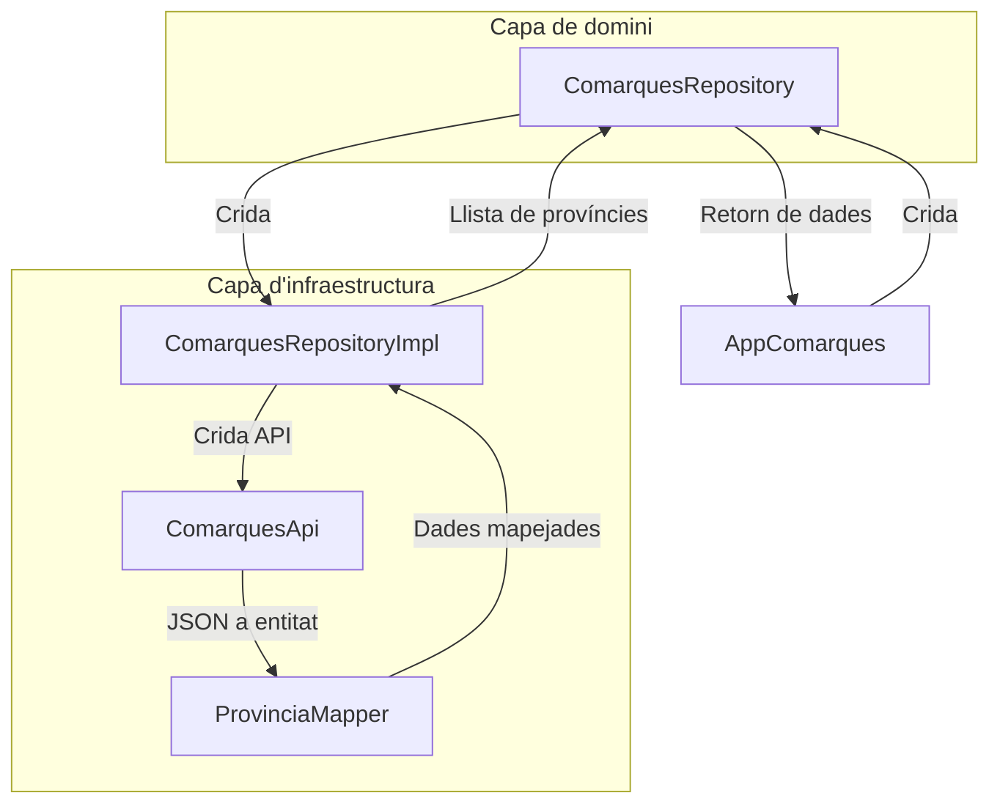

## 1.0.0

- Initial version.

```mermaid
flowchart TD
    %% Capa de Domini
    subgraph DOMINI[Capa de domini]
        direction TB
        ComarquesRepository[ComarquesRepository]
    end

    %% Capa d'Infraestructura
    subgraph INFRAESTRUCTURA[Capa d'infraestructura]
        direction TB
        ComarquesRepositoryImpl[ComarquesRepositoryImpl]
        ComarquesApi[ComarquesApi]
        ProvinciaMapper[ProvinciaMapper]
    end

    
    
    %% Flux entre les capes
    AppComarques -->|Crida| ComarquesRepository
    ComarquesRepository -->|Crida| ComarquesRepositoryImpl
    ComarquesRepositoryImpl -->|Crida API| ComarquesApi
    ComarquesApi -->|JSON a entitat| ProvinciaMapper
    ProvinciaMapper -->|Dades mapejades| ComarquesRepositoryImpl
    ComarquesRepositoryImpl -->|Llista de províncies| ComarquesRepository
    ComarquesRepository -->|Retorn de dades| AppComarques
    

```