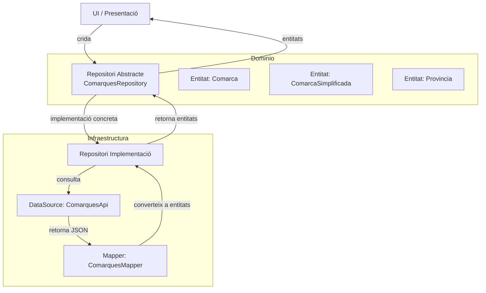

A sample command-line application with an entrypoint in `bin/`, library code
in `lib/`, and example unit test in `test/`.

```mermaid
flowchart TD
    %% Capa de UI / Aplicació
    UI[UI / Presentació] -->|crida| Repo[Repositori Abstracte<br/>ComarquesRepository]

    %% Capa de Domini
    subgraph DOMAIN[Dominio]
        Repo
        Comarca[Entitat: Comarca]
        ComarcaS[Entitat: ComarcaSimplificada]
        Provincia[Entitat: Provincia]
    end

    %% Capa d'Infraestructura
    subgraph INFRA[Infraestructura]
        API[DataSource: ComarquesApi] 
        Mapper[Mapper: ComarquesMapper] 
        RepoImpl[Repositori Implementació<br/ComarquesRepositoryImpl]
    end

    %% Flux de dades
    Repo -->|implementació concreta| RepoImpl
    RepoImpl -->|consulta| API
    API -->|retorna JSON| Mapper
    Mapper -->|converteix a entitats| RepoImpl
    RepoImpl -->|retorna entitats| Repo
    Repo -->|entitats| UI
```